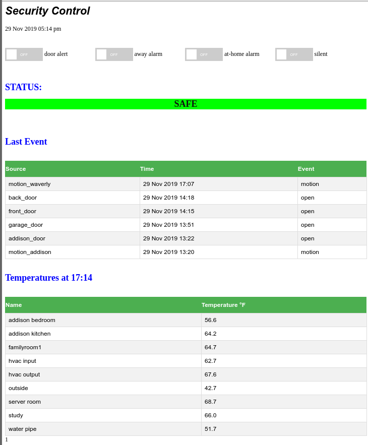

# Repurpose Honeywell wireless sensors from an ADT system into a better interface 

I couldn't believe the 1960 "select code 43 to ..." that the alarm keypads use for alarm systems. So I wrote code to listen to the sensors using a n RTL radio, and provide a graphical interface to set alerts/alarm via a web page that does not require any monthly service - it is hosted on a Raspberry Pi in your house. It sounds alarms through both a speaker connected to the Pi, and if you have google home it can use those devices to broadcast door alerts and alarms.

Features
- web/touch interface for remote operation
- door alert
- home alarm/away alarm
- email/text notification when alarm goes off
- uses Google home to sound messages/alarms
- lists last event for each device
- lists devices that have not sent signal in a day
- optional list temperature sensors
- stores all events in a database for analysis

required packages
	postgresql
	rtl_433
	psycopg2
        pychromecast
	gtts

## Installation
Install postgreql and tools
create database from schema provided
add devices
install apache2
use config file provided
use a password file for the "alarm" user
if you need external access, use your router to provide access from the external internet
